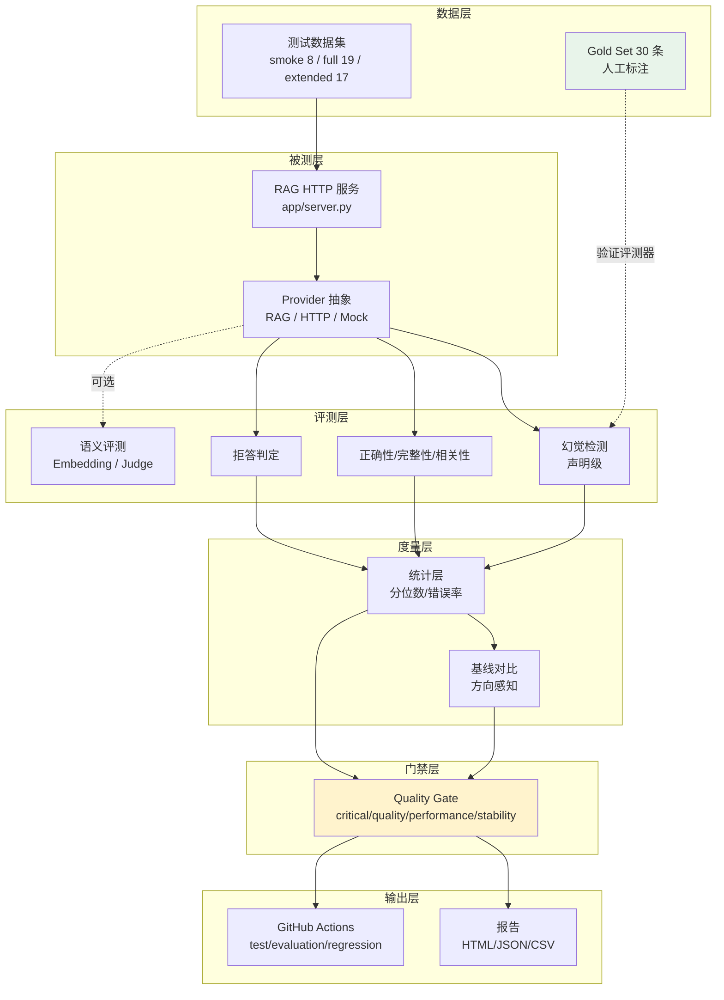

# LLM 质量评测与门禁系统

> 面向 RAG / LLM 应用的自动化测试与质量门禁。
> 验证对象是**输出质量**，不只是「接口能不能通」。

---

## 这个项目在解决什么问题

RAG / LLM 应用的测试与传统接口测试不一样：

| 传统接口测试 | LLM 应用测试 |
|---|---|
| 输出确定，同样输入必然同样输出 | 输出不确定，同一问题两次回答可能不同 |
| 用 `assert response.status == 200` 判定 | 「200 但答案是错的」也算失败 |
| 需求写清楚了，实现就是对的 | 实现对了但模型可能编造 |

最危险的一点是：**LLM 应用的失败会静悄悄发生**。
返回 200、格式正确、逻辑通顺——但内容是编的。
传统测试手段完全抓不到。

本项目做的事：**把「内容质量」变成可自动判定的指标**，
并用门禁在质量退化时拦住版本。

---

## 核心能力

```
测试数据 → 被测RAG API → 幻觉/正确性/完整性/相关性评测
                              ↓
                        拒答能力 · 稳定性
                              ↓
                     质量门禁（分层阈值）
                              ↓
              pytest → GitHub Actions → 测试报告
```

| 能力 | 说明 | 真实状态 |
|---|---|---|
| **声明级幻觉检测** | 把回答拆成原子声明，逐条找上下文依据 | 已实现，变异检出率 95.3% |
| **接口契约测试** | 状态码 / schema / 超时 / 5xx | 47 项，离线可跑 |
| **异常与边界测试** | 13 类异常，每类断言具体行为 | 36 项 |
| **端到端集成测试** | HTTP → Provider → 评测器贯通 | 32 项 |
| **性能与并发** | 5/10/20 并发，QPS / P95 / P99 / 错误率 | 17 项 |
| **变异测试** | 把输入改坏，看评测器能否发现 | 已落地 |
| **质量门禁** | 4 层 13 条规则，critical 层不可用即失败 | 已实现 |
| **基线退化检测** | 方向感知 + 可比性校验 | 已实现 |
| **阈值校准** | 在标注数据上扫描阈值，给出权衡曲线 | 30 条样本 |

---

## 架构



**分层解耦**：数据集、Provider、评测器、统计层、门禁各自独立。
换被测系统只需新增一个 Provider；换评测算法不影响门禁与报告。

---

## 快速开始

```bash
# 1. 安装（唯一必需依赖）
pip install pytest

# 2. 配置 API（只对本项目生效，不污染系统环境变量）
cp env.example .env
# 编辑 .env 填入 API Key

# 3. 自检
python -m eval config        # 查看配置（密钥脱敏）
python -m eval list          # 列出数据集

# 4. 跑评测（不需要 API Key 也可跑）
python -m eval run --dataset smoke --mock

# 5. 真实评测
python -m eval run --dataset smoke
```

---

## 幻觉是怎么判定的

不是「关键词覆盖率低 = 幻觉」。流程是：

```
回答 → 拆成原子声明 → 每条找上下文依据 → 逐条判定
                                        ├─ 覆盖率 ≥ 0.6  → 有支撑
                    ├─ 覆盖率 ≥ 0.35 → 支撑不足
                                        └─ 覆盖率 < 0.35 → 无支撑 → 幻觉
```

额外检测三类**字面重合度高但语义错误**的情况：

| 类型 | 例子 | 检出方式 |
|---|---|---|
| 数字冲突 | 上下文「3 个字段」，回答说「15 个字段」 | 上下文中不存在的数字 |
| 否定翻转 | 上下文「关注状态码」，回答说「完全不关注」 | 极性检测（字面重合 0.625 也拦得住） |
| 情态推测 | 上下文未提及，回答说「可能还包括…」 | 情态词 + 覆盖率不足 |

---

## 评测器自己可靠吗

这是最容易被跳过、但最该回答的问题。

### 两种验证方式

**1. Gold Set 反向测量**（查误报）

```
$ python -m eval.evaluators.validation

已人工复核     30（100%）
混淆矩阵
  TP（正确检出幻觉）  14
  FN（漏报·最危险）   0
  FP（误报）           1
  Accuracy   96.7%
  Precision  93.3%
  Recall     100.0%   ← 漏报控制
  FPR         6.2%
```

**2. 变异测试**（查漏报）

把正确答案故意改坏，看评测器能否发现：

```
$ python -m eval.mutation

样本用例 27 / 变异总数 186 / 检出率 0.9533

类型           应检出   检出   漏报   检出率
答案替换           26    26     0     100%
追加伪事实         52    52     0     100%
数字篡改            6     6     0     100%
否定翻转           13    12     1      92%
实体调换            8     6     2      75%
因果倒置            1     0     1       0%   ← 盲区
时序错乱            1     0     1       0%   ← 盲区
```

> `因果倒置` 与 `时序错乱` 的分母是 1，检出率 0% 意味着
> **字符级覆盖率算法对这类语义倒置无能为力**。这是真实盲区，不回避。

---

## 指标定义

每个指标都写清了**算法、局限**。完整说明见 `python -m eval.thresholds`。

| 指标 | 算法 | 局限 |
|---|---|---|
| `faithfulness` | 回答拆分为原子声明，逐条计算实词覆盖率 | 无法识别「换个说法说同一错误」 |
| `hallucination_rate` | 存在无支撑声明的用例占比 | 按用例计数，不按声明计数 |
| `answer_correctness` | 必需事实覆盖率 − 命中禁止事实 | 字符级匹配，同义改写会低估 |
| `completeness` | required_facts 覆盖比例 | 依赖标注质量，标注不全会误判 |
| `relevance` | 事实覆盖率 → 参考答案相似度 → 上下文相似度（三级） | 跑题检测依赖实词交集 |
| `refusal_accuracy` | 区分该拒答与过度拒答 | 依赖拒答措辞的统一词表 |
| `consistency` | 同一问题重复调用的内容 Jaccard | 样本仅取前若干条 answer 类用例 |
| `error_rate` | error 条数 / 总条数（**分母含 error**） | 与 pass_rate 分母不同，勿混用 |
| `p95_latency_ms` | 线性插值分位数 | 样本量小时区分度有限 |

**关于 `pass_rate` 与 `error_rate` 的分母**：

```
pass_rate  的分母排除 error  → API 全挂时是 None（没测成），不是 0
error_rate 的分母包含 error  → API 全挂时是 1.0，不是 0
```

这两个设计都来自同一个教训：**「没测到」和「测了但没通过」必须区分**。
混为一谈会让系统越坏，CI 反而越绿。

---

## 阈值从哪来

`eval/thresholds.py` 里的 15 项阈值是**工程初始值**，
来源只有两类，都写在代码里：

- `heuristic` —— 领域内常见做法，无本地实验支撑
- `observed` —— 在 30 条 Gold Set 上观察后手工设定

**它们不是从大规模标注实验拟合出来的。** 校准工具提供数据参考：

```
$ python -m eval.calibrate

阈值    准确率   精确率   召回率     F1   误报率   漏报率
0.45    86.7%   91.7%    78.6%  84.6%    6.2%   21.4%
0.60    90.0%   92.3%    85.7%  88.9%    6.2%   14.3%   ← 当前值
0.75    83.3%   80.0%    85.7%  82.8%   18.8%   14.3%
0.80    86.7%   81.2%    92.9%  86.7%   18.8%    7.1%

F1 最优：阈值 0.55
没有任何阈值能把漏报率压到 5% 以下
```

选阈值是**业务决策**，不是技术决策：误报和漏报的代价完全不对称。
漏报到生产环境的代价通常远大于误报。

---

## 测试数据

| 数据集 | 条数 | 用途 | 标注状态 |
|---|---|---|---|
| `smoke` | 8 | CI每次提交 | 作者构造 |
| `full` | 19 | 手动触发、发版前 | 作者构造 |
| `extended` | 17 | 覆盖**测试类型**（总结/条件/数据异常/边界/对抗） | 作者构造 |
| `coverage` | 30 | 覆盖**推理难度**（单事实/多跳/对比/拒答/诱导） | 作者构造 |
| `gold_set` | 30 | 验证评测器自身 | **已人工复核** |

评测用例合计 **74 条**（不含 gold_set——后者是标注数据，不是被测系统的用例）。

`extended` 与 `coverage` 的分工是**两条线交叉**：

```
extended  按「测试类型」切  → 这个系统会遇到哪些形状的输入
coverage  按「推理难度」切  → 同一形状下，推理复杂度到哪一档
```

`coverage` 的五类配比与真实表现：

| 意图分组 | 条数 | 实测通过率 |
|---|---|---|
| 单事实精确提问 | 8 | 75% |
| 多跳推理 | 6 | **50%** |
| 对比类 | 5 | 40% |
| 超纲与拒答 | 7 | 86% |
| 诱导与边界 | 4 | **25%** |

难度梯度清晰：拒答类基本能做对，多跳与对比明显更难，
而「诱导与边界」最差——夹带危险请求的题模型会犹豫，
被字数格式诱导的题会照做。

这说明数据集有鉴别力：不是所有题都一样难度。

---

## CI 怎么跑

拆成三档，职责互不重叠：

| Workflow | 触发时机 | 跑什么 | 需要 Key |
|---|---|---|---|
| `test.yml` | 每次提交、每个 PR | 单元 + 接口 + 异常 + 性能 | 否 |
| `evaluation.yml` | PR / push / 每日定时 | 真实评测 + 门禁 | 是 |
| `regression.yml` | push main / 每日定时 | 变异测试 + 退化检测 | 部分 |

**PR 只跑 smoke**：真实 API 按 token 计费，PR 上跑全部既慢又贵。
更全面的评测放在合并后。

**门禁失败不让 CI 变红**。这是刻意设计：

被测的 RAG 系统确实有幻觉（实测幻觉率 12.5%），评测器把它拦下是**正确行为**。
若门禁失败就 CI 失败，CI 会长期是红，久而久之没人再看，等于没有门禁。

真正让 CI 失败的是退出码 `2/3/4` —— 配置错误、数据错误、运行错误，
这些是**链路坏了**，不是质量问题。

---

## 本地测试怎么跑

用 marker 分区，按代价递增：

```bash
pytest                    # 默认：离线，约 30 秒
pytest -m api             # 接口测试
pytest -m perf            # 性能测试
pytest -m live            # 真实 API（需 Key）
```

marker 由 `tests/conftest.py` **自动分类**，依据是：
测试所在目录、是否用到 live fixture、源码里是否声明了 `needs_api`。
不需要给 500+ 个测试逐个加装饰器，也不会因为漏标而跑到错误阶段。

### 两个提交前自检

这两个工具的存在源于一次真实的教训：
**同一个问题在本地全绿、在 CI 连挂三轮**。

```bash
python -m tests.check_undefined_names   # 0.9 秒
python -m tests.simulate_ci            # 约 30 秒
```

| 工具 | 防的是什么 | 耗时 |
|---|---|---|
| `check_undefined_names` | 版本差异：同一份代码本地 3.14 宽松、CI 3.11 严格 | 0.9 秒 |
| `simulate_ci` | 配置差异：本地有 `.env`、CI 没有 | 约 30 秒 |

两者都已接入 CI 的 lint 阶段，排在单元测试之前——
失败信息会直指真正原因，而不是「10 个测试文件出错」让人摸不着头脑。

### 遇到 CI 失败时的排查顺序

按这个顺序，能少走很多弯路：

1. **看报错的工作流名**，确认改的是哪一份
   （曾因两份内容近似的 workflow 并存，修了一份漏一份）
2. **确认改动合进 `main` 了吗** —— 分支上的修复不等于主分支的修复
3. 本地跑 `simulate_ci`，看是否能在本地复现
4. 以上都排除了，才考虑 GitHub 侧的差异

---

## 已知限制

这一节是本项目最有价值的部分。

### 评测器本身的局限

1. **Gold Set 存在循环论证**
   30 条样本的题目、答案、标签、以及评测器的检测规则**全部出自同一作者**。
   评测器的规则是为检出这些样本的缺陷而设计的，用同一批数据验证它，
   结论天然偏乐观。**这是本项目最大的方法论局限。**

2. **没有第二位标注者**
   缺标注者间一致性（IAA）指标，无法量化标注质量本身。

3. **样本量太小**
   30 条 Gold Set 上「没有任何阈值能把漏报率压到 5% 以下」。
   这个数字应该理解为「样本不足」，而不是「阈值都调不好」。

4. **变异测试的盲区**
   因果倒置、时序错乱检出率 0%。字符级覆盖率对语义倒置无能为力。

### 被测系统的局限

5. **检索是词频匹配，不是向量检索**
   实测召回率约 82%，扩展集的总结类问题经常检索不到相关片段。
   这是最明显的瓶颈，也是最该先改的地方。

6. **模型会顺着问题惯性编造**
   追问式提问（「那测试人员的工作是什么？」）容易诱导模型编造资料外的内容。

7. **上下文冲突检测能力有限**
   只支持「冒号型」句式。否定型冲突（`A关注Y` vs `A完全不关注Y`）
   因主体抽取依赖 SVO 语序而漏检——已在测试中如实标注为已知局限。

8. **LLM Judge 未在 CI 中启用**
   偏差控制手段（一致性检查、位置偏好检测）已实现但未接线，
   且 Judge 与被测系统同模型，自我偏好风险未验证。

9. **Embedding 语义评测默认关闭**
   `fact_coverage` 阈值 0.65 调过但走的是死代码路径，CI 未启用。

### 工程上的局限

10. **未配置 branch protection**
    门禁只在 Actions 内生效，**尚未真正阻断 PR 合并**。
    要真正拦住退化版本，需要在仓库设置里开启保护规则。

11. **性能测试用 Mock 为主**
    真实并发压测需要手动启动服务，CI 中未运行。

12. **覆盖率未统计**
    没有 pytest-cov，看不到测试覆盖了哪些代码路径。

---

## 项目结构

```
llm_eval_project/
├── app/                      # 被测系统
│   ├── rag.py                   RAG 问答（Retriever + LLM）
│   └── server.py                HTTP 接口层（零依赖）
│
├── eval/                     # 评测框架
│   ├── providers/                Provider 抽象：RAG / HTTP / Mock
│   ├── evaluators/               幻觉 / 正确性 / 拒答 / 语义 / Judge
│   ├── datasets/                 smoke / full / extended / gold_set
│   ├── metrics/                  统计层（分位数、错误率）
│   ├── quality_gate/             分层门禁
│   ├── reporting/                HTML / CSV / JSON 报告
│   ├── thresholds.py             阈值集中管理
│   ├── baseline.py               基线对比
│   ├── mutation.py               变异算子
│   ├── calibrate.py              阈值校准工具
│   └── config_loader.py          配置加载
│
├── tests/                    # 测试
│   ├── api/                      接口契约
│   ├── negative/                 异常与边界
│   ├── integration/              端到端
│   ├── performance/              性能与并发
│   ├── mutation/                 变异测试
│   ├── evaluators/               评测器单测
│   ├── regression/               历史缺陷回归锁
│   └── unit/                     数据结构单测
│
├── .github/workflows/        # CI（三档）
│   ├── test.yml                  单元 + 接口 + 异常 + 性能
│   ├── evaluation.yml            真实评测 + 门禁
│   └── regression.yml            变异 + 退化检测
│
├── knowledge/                # 知识库
├── goldset/                  # 人工标注数据
├── configs/                  # 门禁阈值
├── pytest.ini                # marker 分区
└── requirements.txt
```

**运行依赖：0 个第三方库**（标准库实现，包括 YAML 解析）。
开发依赖只有 `pytest`。

---

## 这个项目不是什么

- **不是**工业级 LLM 评测平台
- **不是**通用测试框架
- **不是**模型训练 / 微调工具
- **没有**做到 100% 准确率——做不到，字符级算法有先天盲区

它是一个**能跑通、能复现、能说清边界**的测试开发项目。
